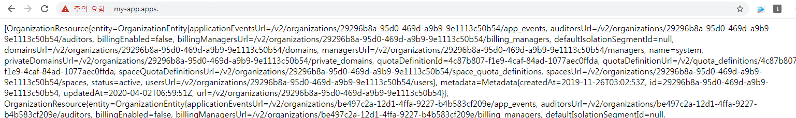

# cf App - user-provider-service
- CUPS는 create-user-provider-service의 줄임말입니다. Cloud Foundry는 Service Broker API를 사용하여 Market Place를 기반으로 SaaS 형태의 App 또는 VM 형태로 관리 할 수 있는 서비스가 존재합니다. 예시로 현재 PCC, SSO, SCS를 개발자가 필요 할 시 Market Place에서 꺼내서 사용 합니다.

- Market Place 조회 예시 값
```
$ cf m # 또는 $ cf marketplaces
OK

service              plans                                                                       description                                                                                                                                                         broker
p-cloudcache         extra-small, small, medium, large, extra-large, dev-plan, small-footprint   Pivotal Cloud Cache(PCC version "1.11.0-build.38", GemFire version "9.9.1") offers the ability to deploy a GemFire cluster as a service in Pivotal Cloud Foundry.   cloudcache-broker
```

- Service Broker API를 통해 노출 된 Service들을 Plan과 함께 `cf create-service` 명령을 통하여 Service Instance를 생성 후 사용 되며 Abacus와 같은 Opensource를 사용하여 audit(사용량)을 집계 할 수 있습니다.
- 하지만 Service Broker API를 사용하지 않는 외부용 서비스를 PAS에서 통합하여 사용 할 경우 `create-user-provider-service`가 반드시 필요하게 됩니다. 예시로 현재 Oracle DB, Kafka의 Endpoint와 인증 정보를 cups하여 PAS와 통합하여 App에서 호출하도록 설계되어 있습니다. Bosh Release 문서에서 언급되었듯이 해당 서비스 마찬가지로 Release화 하여 Bosh가 관리 할 수 있게끔 생성 할 수도 있습니다.

## 1. CUPS의 사용 방법
- 예시로 Oracle DB, Kafka가 아닌 Cloud Foundry API를 사용하여 ORG 목록을 조회하는 Sample을 설명합니다.

 
### 1.1. Cups 대상의 Entity 설정 & App 연동
- Cups 설정 Entity는 Cloud Foundry API를 사용하기 위해서 api_endpoint, user, user_pwd를 선정하였습니다.


```
$ cf create-user-provided-service cf_api -p '{"endpoint":"api.sys.{DOMAIN}","user":"xxxxx", "pwd": "xxxxx"}'
$ cf bind-service {APP_NAME} {SERVICE_INSTANCE_NAME:cf_api }
$ cf restage {APP_NAME}

# 환경 변수를 확인합니다. cups를 사용 할 경우 user-provided로 생성 됩니다.
$ cf env {APP_NAME}
{
 "VCAP_SERVICES": {
  "user-provided": [
   {
    "binding_name": null,
    "credentials": {
     "endpoint": "api.sys.{DOMAIN}",
     "user": "admin",
     "pwd": "xxxxxxxx"
    },
    "instance_name": "cf_api",
    "label": "user-provided",
    "name": "cf_api",
    "syslog_drain_url": "",
    "tags": [],
    "volume_mounts": []
   }
  ]
 }
}

```

### 1.2.  App Source Code
- application.yml

```
---
spring:
  profiles: cloud
  application:
    name: cloud-boot-app

cf.endpoint: ${vcap.services.cf_api.credentials.endpoint}
cf.admin: ${vcap.services.cf_api.credentials.user}
cf.admin_secret: ${vcap.services.cf_api.credentials.pwd}
```


- Java Sample Code

```
@Value("${cf.endpoint:test}")
String cf_endpoint;
@Value("${cf.admin:test}")
String cf_admin;
@Value("${cf.admin_secret:test}")
String cf_admin_secret;

@GetMapping("/")
public String main() throws Exception{
	
    DefaultConnectionContext getApiConnect = connectionContext(cf_endpoint);
    PasswordGrantTokenProvider getToken = tokenProvider(cf_admin, cf_admin_secret);
    ReactorCloudFoundryClient client = cloudFoundryClient(getApiConnect, getToken);
    Organizations orgClinet = client.organizations();
	StringBuilder sb = new StringBuilder();
	List<OrganizationResource> orgList = orgClinet.list(ListOrganizationsRequest.builder().name("").build()).block().getResources();
	sb.append(orgList);
	return sb.toString();
}
```


- 결과 화면



