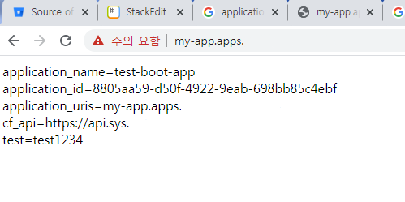

# cf App - Env 동작 방법
- Pivotal  PAS App에서의 환경 변수 사용에 대한 방법을 설명합니다.
- Pivotal  PAS App에서 환경 변수 사용은 Code base 배포 방법론에 따른 설정 방법 변경(dev/prod/test/staging)과 같은 배포 방법이나 git 같은 협업툴을 사용하여 버전 관리를 할 경우, 내부와 외부 소스코드의 분리를 바탕으로 인증 코드가 유출 없이 개발을 할 경우 용이하게 사용 됩니다. (추 후 기타 서비스 샘플에서 가이드)
- Pivotal PAS - Service Instance를 이용 할 경우에 Env 사용을 기본으로 합니다.
- Spring Boot는 기본적으로 /src/main/resource의 application.yml, application.properties를 통해 Java Source code로 환경 변수를 가져옵니다. 

## 1. cf Env Sample Code

### 1.1 cf app env 확인
- PAS에서 가동 중인 App의 기본적인 환경 변수는 아래와 같습니다.

```
$ cf env {APP_NAME}
{
 # Bind 한 Service의 정보 영역
 "VCAP_SERVICES": {
  "p.config-server": [
   {
    "binding_name": null,
    "credentials": {
     "credhub-ref": "/c/p.spring-cloud-services-scs-service-broker/e9ca123d-c312-4f57-88a4-aef09e887f83/4e315082-7a8f-4b38-97a2-fd652cc7f963/credentials-json"
    },
    "instance_name": "config-service",
    "label": "p.config-server",
    "name": "config-service",
    "plan": "standard",
    "provider": null,
    "syslog_drain_url": null,
    "tags": [
     "configuration",
     "spring-cloud"
    ],
    "volume_mounts": []
   }
  ]
 }
}

{
 # Application 정보 영역
 "VCAP_APPLICATION": {
  "application_id": "7b34261f-279e-4c4e-97ba-2b066f24e7ba",
  "application_name": "test-auto",
  "application_uris": [
   "test-auto.xxx"
  ],
  "application_version": "74c8eab6-86ba-448c-bc9b-89ffdc6ef2e0",
  "cf_api": "https://xxx",
  "limits": {
   "disk": 512,
   "fds": 16384,
   "mem": 1024
  },
  "name": "test-auto",
  "organization_id": "b4d33f63-b5ae-4476-9dc7-8a3da88024fb",
  "organization_name": "xxx",
  "process_id": "7b34261f-279e-4c4e-97ba-2b066f24e7ba",
  "process_type": "web",
  "space_id": "5adbb8e6-5316-4027-9eb8-2e49efc14fea",
  "space_name": "xxx",
  "uris": [
   "xxx"
  ],
  "users": null,
  "version": "74c8eab6-86ba-448c-bc9b-89ffdc6ef2e0"
 }
}
```

### 1.1 cf app env를 Java 소스에서 동적으로 가져오는 방법
- 해당 예시는 사용자가 설정한 환경 변수 및 App의 기본 환경 변수를 가져오는 방법에 대한 동작을 설명합니다.

#### 1.1.1. manifest 확인 & cf push

```
---
applications:
- name: test-boot
  memory: 1G
  buildpack: java_buildpack_offline
  path: ./target/test-boot-0.0.1-SNAPSHOT.jar
  env:
    test: test1234


$ cf push -f manifest.yml
```

#### 1.1.2. Java Source Code 일부 발췌

- application.yml
	- spring.profiles를 사용하여, dev/staging/prod/test의 단계를 구분 할 수 있습니다. profiles을 명시하지 않으면 Build 시 치환 대상의 변수에 대한 에러가 발생합니다.
	 
```
---
spring:
  profiles: cloud
  application:
    name: test-boot-app

vcap.application.application_id: ${vcap.application.application_id}
vcap.application.application_name: ${vcap.application.application_name}
vcap.application.application_uris: ${vcap.application.application_uris}
vcap.application.cf_api: ${vcap.application.cf_api}
test: ${test}

```
- main.java

```
@GetMapping("/")
public String home() throws Exception{
	StringBuilder sb = new StringBuilder();
	sb.append("application_name=" + application_name+"</br>");
	sb.append("application_id=" + application_id+"</br>");
	sb.append("application_uris=" + application_uris+"</br>");
	sb.append("cf_api=" + cf_api+"</br>");
	sb.append("test=" + test+"</br>");
	return sb.toString();
}
```

- 결과 화면




