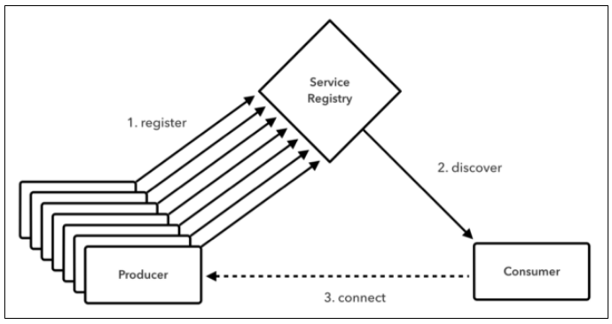
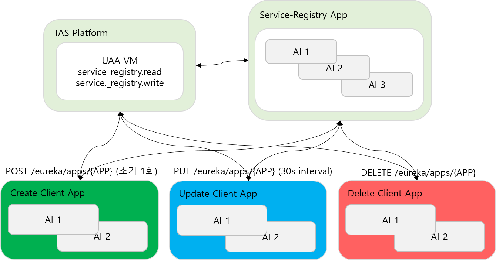

# cf App - Service Registry 동작 방법
- Service Registry는 Micro Service의 핵심인 Service Discovery 패턴을 지원해줍니다.  Service Discovery란 클라우드 환경에서 동적으로 생성(Container 방식의 유동적인 IP/PORT/Domain)되거나 많은 량의 Autoscaling 되어 감당 할 수 없는 Instance 수로 늘어 날 경우에 Micro Service App의 IP와 PORT, Domain을 중앙에서 Client 형태로 관리합니다.
- A Micro Service App은 B Micro Service APP에 요청을 보낼 때 A는 Service registry 중간 관리자(E)에게 B의 위치(주소)를 물어보고 등록 된 주소를 받아서 B에게 요청을 합니다. 이때 요청에 대한 정보는 Client의 Local Cache에 저장 됩니다.
- Eureka는 netflix-ribbon Round Robin LoadBlancer를 지원합니다.



1) Micro Service Architecture에서 모든 Service App들은 Client로 Registry에 등록이 됩니다. 
2) Eureka Client는 자기 자신을 Registry에 등록하고 hostname, ip address, port Metadata를 전송합니다.
3) Eureka Server는 각 Client로 부터 30초마다(변경 가능) heartbeat를 수신하게 되며 heartbeat를 수신 하지 않을 경우 Client 관계를 끊습니다.

## 1. 기본적인 Service-Registry Client 사용 방법

### 1.1. 준비 사항
- Pivotal Serivce-Registry Service와 Service Key를 생성하고 접속 정보를 GET 합니다.

```
# 서비스 생성
$ cf create-service p.service-registry standard bureau-service-test
# 서비스 키 생성 (인증정보)
$ cf create-service-key bureau-service-test local-access

# 생성한 local-access key의 정보는 아래와 같습니다.
- name: /c/p.spring-cloud-services-scs-service-broker/37a15060-c98c-461e-95e3-1ccf40448bd6/ad15bd42-b463-4de4-9d30-67817ee03214/credentials-json
$ credhub get -n /c/p.spring-cloud-services-scs-service-broker/37a15060-c98c-461e-95e3-1ccf40448bd6/ad15bd42-b463-4de4-9d30-67817ee03214/credentials-json

67817ee03214/credentials-json
id: b1ce01b8-506d-4b05-a6a8-ad9e81e4ba38
name: /c/p.spring-cloud-services-scs-service-broker/37a15060-c98c-461e-95e3-1ccf40448bd6/ad15bd42-b463-4de4-9d30-67817ee03214/credentials-json
type: json
value:
  access_token_uri: https://uaa.sys.xxxx.xxxx.xx.xx:443/oauth/token
  client_id: registry-client-ad15bd42-b463-4de4-9d30-67817ee03214
  client_secret: xxxxx
  uri: https://service-registry-d565260a-7f82-40a3-9cbc-869626ea3b81.apps.xxxx.xxxxx.co.kr
version_created_at: "2020-04-20T07:14:28Z"
```

- Service Key는 Service-Registry의 인증 정보이며, App에 해당 Service를 bind하게 되면 자동으로 생성되는 인증 정보 입니다. Local에서 Opensource 방식으로 PAS 환경에 연동 할 경우에 필요한 정보 입니다.

### 1.2. application.yml 파일 설정

```
---
spring:
  application:
    name: test-boot-app-client2
eureka:
  client:
    fetchRegistry: true
    serviceUrl:
      defaultZone: https://service-registry-23bf06db-8330-447f-a7ac-bb13cc602257.apps.xxx.xxx.co.kr/eureka/
    enabled: true
    oauth2:
      accessTokenUri: https://uaa.sys.xxx.xxx.co.kr:443/oauth/token
      clientId: registry-client-f4295ac2-6338-4a9e-8b53-6e0f2818c867
      clientSecret: xxxx
```

- spring.application.name: test-boot-app-client2 명은 대문자의 형태(TEST-BOOT-APP-CLIENT2)로 Eureka defaultZone에 등록되는 Client Name이 되며 추 후 해당 Client의 Naming을 가지고 IP/PORT 또는 Domain을 Return 받습니다.

### 1.3. Java Source Code

- Java Source Code 예시는 RestTemplate를 이용하여 Micro Service로 Rest Request와 FeignClient를 사용하여 Micro Service의 Client 객체를 생성하여 Request하는 방법이 있습니다.

#### 1.3.1. Java Source Code 1 RestTemplate
- RestTemplate를 사용 할 경우 @LoadBalanced를 사용 할 경우 자동적으로 RibbonLoadBalnacer를 사용하게 됩니다.

```
public String serviceUrl() {
    InstanceInfo instance = discoveryClient.getNextServerFromEureka("TEST-BOOT-APP-CLIENT2", false);
    return instance.getHomePageUrl();
}

@GetMapping("/getClient1")
public String getClient1(){
	String clientUrl = serviceUrl();
	RestTemplate rest = new RestTemplate();
	return rest.getForObject(clientUrl, String.class);
}
```
- Return 대상의 String 값은 TEST-BOOT-APP-CLIENT1의 IP:PORT 또는 Domain 값으로 Return이 되며 해당 Endpoint를 통해 HTTP/HTTPS Rest API를 호출 할 수 있습니다. 

#### 1.3.2. Java Source Code 1 FeignClient

- ServiceRegisrtyInterface.java

```
@FeignClient(name = "TEST-BOOT-APP-CLIENT2")
public interface ServiceRegisrtyInterface {
	 @RequestMapping(method = {RequestMethod.GET},path = {"/"})
	 String getClient2();
}
```

- SimpleBootApplication.java (Controller Sample)

```
# 위에서 선언된 ServiceRegisrtyInterface Interface를 Autowired
@Autowired
private ServiceRegisrtyInterface client2;

@GetMapping("/getClient2")
public String getClient2(){
	return client2.getClient2();
}
```


## 2. PAS Service-Registry Lifecycle




## 3. TIP

### 3.1. p-Service-Registry Endpoint
1) https://service-registry-xxxx-xxx-xxx-xxx.apps.xxxx.xxx.co.kr/dashboard/userinfo
	- 해당 Service Registry에 발급 된 User Client 정보들을 확인 할 수 있습니다.

2) https://service-registry-xxxx-xxx-xxx-xxx.apps.xxxx.xxx.co.kr/dashboard/apps
	- 해당 Service Registry에 등록된 Client의 Metadata를 확인 할 수 있습니다.

3) https://service-registry-xxxx-xxx-xxx-xxx.apps.xxxx.xxx.co.kr/actuator/httptrace
	- 해당 Service Registry의 최근 100건의 HTTP/HTTPS Request의 Status를 확인 할 수 있습니다.


