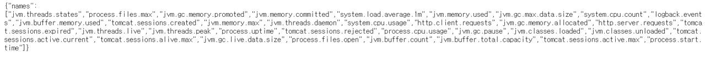

# TAS - Micrometer 연동 App Metrics
- 해당 문서는 Java App의 Metrics를 추가적으로  등록하여 Pivotal Metrics Product 화면에서 출력하는 방법에 대해 가이드합니다.
- 기본적으로 App에 대한 Prometheus Actuator Endpoint를 Enable 시켜 Metric Registrar를 통해 Loggregator가 사용 가능한 Metrics로 가공을 합니다.
- 기본적으로 PAS는 내부적으로 Metrics Endpoint와 Prometheus 호환 prom_scraper 기능을 제공 합니다.


## 1. TAS Config 설정
- Ops Manager 화면에서 PAS Tile의 Metric Registrar 설정을 변경 합니다.
- 변경 대상은 아래와 같습니다.
	- Enable Metric Registrar: Enable -> Metric Registrar를 활성화 합니다.
	- Endpoint scraping interval: 35 -> Metrics Endpoint에서 Metrics를 scraping 하는 시간을 설정 합니다. 사용 예시는 35초 마다 Metrics를 수집 합니다. 
	- Blocked tags: deployment,job,index -> Micro Meter Endpoints에 id가 필요함으로 id를 Blocked에서 제거 합니다.
- 변경 사항을 [Apply Change]를 통해 적용 합니다.

###2. Java Source Code 변경 & cf push

### 2.1.  App Metrics를 수집하기 위해 Micrometer Dependency를 설정 합니다. 
- Micrometer는 Datadog, Dynatrace, Promethes 등에 App Metric 수집에 대한 Endpoint를 제공 합니다.

```
<!-- Micrometer Prometheus registry -->
<dependency>
    <groupId>io.micrometer</groupId>
    <artifactId>micrometer-registry-prometheus</artifactId>
</dependency>
```
### 2.2. Micrometer를 사용하기 위해 Spring Actuator Dependency를 설정 합니다. (이미 존재하면 생략 가능)
```
<dependency>
    <groupId>org.springframework.boot</groupId>
    <artifactId>spring-boot-starter-actuator</artifactId>
</dependency>
``` 
#### 2.3. application.yml 파일 수정

```
management:
  endpoints:
    web:
      exposure:
        include: "*" or "prometheus,health,info 등"
```

### 2.4. End Point 중간 확인
- 2.1 ~ 2.3에서 대한 설정을 완료하고 로컬에서 Tomcat을 실행하면 Actuator Endpoint가 자동으로 열게 됩니다. 본 문서에서는 include: "*"를 사용하여 모든 Actuator Endpoint를 활성화 하였습니다.

- Actuator 전체 Endpoint 확인 (크롬 브라우저 확인)
	- http://localhost:8080/actuator
	- http://localhost:8080/actuator/prometheus


### 2.5. 해당 actuator / actuator/prometheus가 활성화 되었다면 Pivotal Application Service에 app을 push 합니다.
```
$ cf push {my-app} -f mainifest.yml
```

### 2.6. cf push 대상의 App End Point 확인
- Pivotal Application Service에 배포한 App의 Route 정보를 통해서 Actuator 전체 Endpoint 확인 합니다.
	- http://test-app-metrics.apps.{DOMAIN}/actuator
	- http://test-app-metrics.apps.{DOMAIN}/actuator/prometheus



